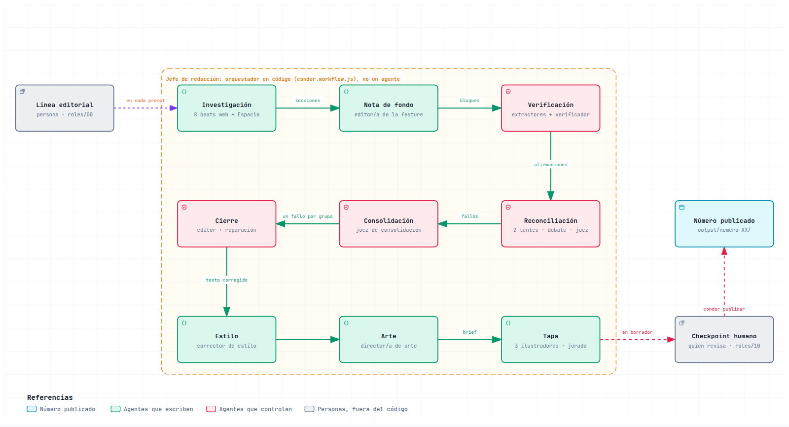
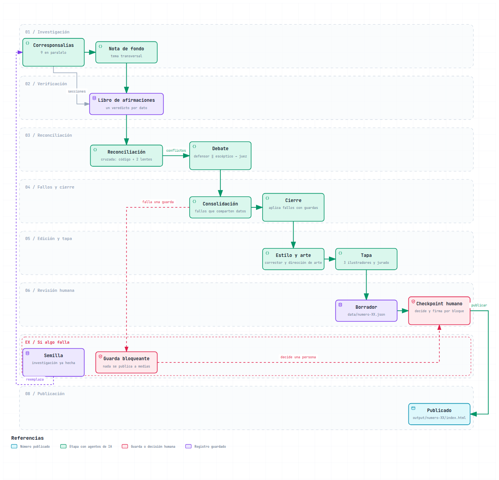
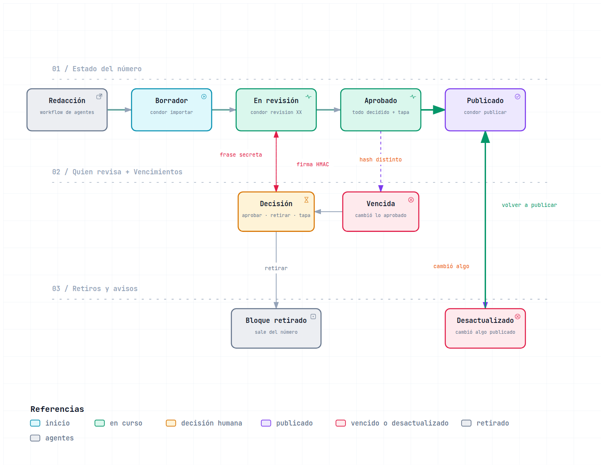

# Cóndor

**Una revista de inteligencia artificial, tecnología y ciencia con foco en Argentina y América Latina,
escrita por una redacción de agentes de IA y aprobada por una persona antes de publicarse.**

Cada número lo investigan, redactan, verifican e ilustran agentes orquestados con Workflows de
Claude Code. Cada dato duro se verifica por separado, las notas se comparan entre sí para detectar
contradicciones y, desde el Nº 01, ningún número sale sin que alguien lo revise y firme. Los
agentes no pueden aprobar ni publicar: el código no les deja producir una decisión válida.

"Cóndor" es un nombre de trabajo y puede cambiar.

> **Guía de lectura.** Este README cuenta el proyecto desde el punto de vista editorial.
> Para instalarlo y correrlo, leé el [manual técnico](docs/manual-tecnico.md). El porqué de la
> arquitectura y lo que falta mejorar está en [decisiones y mejoras](docs/decisiones-y-mejoras.md).
> La presentación de la revista para lectores está en la [landing](docs/index.html).
>
> La landing y las versiones interactivas de los diagramas son páginas HTML. GitHub muestra su
> código, no la página: descargalas o abrilas desde una copia local del repo.

---

## Qué es la revista y para quién

**Audiencia.** Lectores con formación técnica en ciencia de datos y machine learning, con base
física o matemática, que quieren seguir la IA global y entender cómo se conecta con Argentina y la
región. El registro apunta a MIT Technology Review o The Gradient: técnico pero legible, ni paper
académico ni divulgación básica. Un colega informado hablándole a un colega en formación.

**Línea editorial** ([`roles/00-linea-editorial.md`](roles/00-linea-editorial.md)):

- Síntesis y no resumen: qué pasó, qué dato lo respalda y por qué importa, en dos o tres oraciones.
- Dato concreto siempre que exista: parámetros, benchmarks, dólares, fechas.
- Nada de lenguaje de marketing ("revolucionario", "cambia todo") sin evidencia que lo respalde.
- En cada modelo de lenguaje se aclara si es open-weight o propietario.
- Nunca se inventa lo que está detrás de un paywall.
- La sección Argentina nunca queda vacía, y al menos dos o tres secciones miran la región.

**Las 9 secciones.** Cada número tiene una nota por sección y una nota de fondo que cruza varias
de ellas en un ángulo propio.

| # | Sección | Qué cubre |
|---|---|---|
| 1 | Modelos fundacionales y LLMs | lanzamientos, benchmarks, open-weight o propietario |
| 2 | Hardware e infraestructura | chips, data centers, energía, memoria |
| 3 | Regulación y política | leyes, controles de exportación, IA militar y gubernamental |
| 4 | Seguridad y alineación | interpretabilidad, incidentes, red-teaming, evaluaciones de riesgo |
| 5 | IA aplicada: Ciencia y salud | descubrimiento de fármacos, genómica, diagnóstico, clima |
| 6 | IA aplicada: Industria y robótica | humanoides, agentes de código, vehículos autónomos |
| 7 | Argentina | política científica, CONICET, INVAP, CONAE, data centers, startups |
| 8 | América Latina | Brasil, Chile, México, Colombia, Uruguay: regulación, inversión, ecosistema |
| 9 | Ciencia y Espacio: Patagonia | el "cielo de la semana" con datos en vivo de satélites |

La sección de Espacio es distinta: no busca en la web. Consulta un servidor MCP de seguimiento
satelital (`patagonia-espacial`) y arma la nota con pasos reales sobre una ciudad patagónica,
Bariloche por defecto. Demuestra que una sección puede alimentarse de una fuente de datos
estructurados y no sólo de búsquedas.

---

## Cómo trabaja la redacción

La redacción copia la división de tareas de una revista real. Hay tres tipos de integrantes:
**personas**, **agentes** (modelos de lenguaje con un rol, instrucciones y herramientas acotadas) y
**código** (lo que no es una decisión editorial, como repartir el trabajo o maquetar).

<picture><source media="(prefers-color-scheme: dark)" srcset="docs/img/redaccion-oscuro.png"></picture>

[Versión interactiva](docs/diagramas/redaccion.html)

### Las personas

- **Dirección editorial.** Escribe la línea editorial. No corre en cada número: es un documento
  fijo, y un resumen suyo va en las instrucciones de los agentes que escriben (corresponsales,
  nota de fondo y estilo).
- **Quien revisa.** Lee el paquete de revisión, aprueba o retira cada nota, elige la tapa y
  publica. Es el único rol que el sistema no deja ejecutar a un agente.

### Los agentes

El diseño estimaba entre 55 y 70 agentes por número (peor caso, unos 105). El Nº 01 usó 75, y eso
reusando la investigación de una corrida cortada: sólo Espacio se investigó de nuevo.

| Rol | Qué hace | Cuántos |
|---|---|---|
| Corresponsal | Investiga una sección en la web y entrega una sola nota fuerte, con fuente | 8 |
| Corresponsal de Espacio | Consulta el servidor de satélites y escribe el "cielo de la semana" | 1 |
| Editor de nota de fondo | Lee las nueve notas y escribe una pieza larga que las cruza | 1 |
| Extractor de afirmaciones | Descompone cada nota en datos verificables uno por uno | 1 por nota |
| Extractor de completitud | Si quedan cifras sin afirmación, las extrae en una segunda pasada | 0 a 1 por nota |
| Verificador | Verifica cada afirmación desde cero, con un modelo aparte (`modelo_verificador`) | 1 por nota |
| Reconciliador "hechos" | Busca el mismo hecho contado distinto en dos notas | 1 |
| Reconciliador "cronología" | Busca fechas, duraciones y porcentajes que no cierran | 1 |
| Defensor y escéptico | Debaten cada conflicto: uno sostiene lo publicado, el otro intenta refutarlo | 1 y 1 por conflicto |
| Juez | Decide cada conflicto: mantener, corregir, retirar, matizar o sin consenso | 1 por conflicto |
| Juez de consolidación | Unifica fallos que tocan los mismos datos para que no se contradigan | 1 por grupo de fallos |
| Editor de cierre | Aplica las correcciones con el mínimo cambio, con una ronda de reparación si falla | 1 por nota afectada |
| Corrector de estilo | Homogeneiza tono y nombres sin tocar cifras, fechas ni atribuciones | 1 |
| Director de arte | Elige título del número, copete, nota destacada y brief de tapa | 1 |
| Ilustradores A, B y C | Dibujan una tapa SVG cada uno: tipográfica, metáfora visual, basada en un dato | 3 |
| Jurado de tapa | Puntúa las tapas con dos miradas: editorial y visual | 2 |
| Corrección de tapa | El ilustrador de la tapa ganadora corrige lo que marcó el jurado; otro agente confirma si la versión nueva es mejor | 2 |

### El código

- **Jefe de redacción.** Es el script del workflow ([`pipeline/condor.workflow.js`](pipeline/condor.workflow.js)).
  Reparte las secciones, decide qué espera a qué, junta los resultados y aplica las reglas. No
  escribe contenido.
- **Editor digital.** Arma las páginas finales en Markdown y HTML con plantillas
  ([`condor/render.py`](condor/render.py)). Maquetar no es una decisión editorial.

El detalle de cada rol está en [`roles/`](roles/).

---

## Cómo se verifica el contenido

Los modelos de lenguaje se equivocan con seguridad. La revista no confía en un solo control: apila
varios, cada uno pensado para atrapar un tipo de error que el anterior deja pasar.

<picture><source media="(prefers-color-scheme: dark)" srcset="docs/img/recorrido-oscuro.png"></picture>

[Versión interactiva](docs/diagramas/recorrido.html)

**1. Libro de afirmaciones.** Cada nota se descompone en afirmaciones atómicas: una cifra, una
fecha, un nombre, una atribución. Cada una trae la frase textual de donde sale, y el código
comprueba que esa frase esté en la nota (o, al menos, todas sus cifras); si no, la afirmación se
descarta. Si queda alguna cifra sin afirmación que la
cubra, se hace una segunda pasada; si aun así nadie la verificó, la nota queda bloqueada.
Después, un verificador revisa cada afirmación desde cero: lee la fuente y hace hasta tres búsquedas
propias. Un "confirmado" sin enlace de evidencia baja a "no verificable".
*Por qué:* en el Nº 00 el control daba un veredicto por nota y no podía decir cuál dato estaba mal.
El verificador corre con un modelo aparte (sonnet en el Nº 01) porque un modelo tiende a darse la
razón cuando revisa su propio texto. La redacción usa el modelo de la sesión, que tiene que ser otro.

**2. Reconciliación cruzada.** Cada verificador mira una nota. Nadie comparaba notas entre sí, y
en el Nº 00 la misma cifra quedó "confirmada" en Hardware y "no verificable" en la nota de fondo.
Ahora tres detectores buscan esas contradicciones: uno en código (cifras de la nota de fondo que
no están en ninguna sección, o el mismo dato con veredictos distintos) y dos agentes con miradas
distintas, uno sobre hechos y otro sobre cronologías.

**3. Debate.** Cada conflicto se discute: un defensor sostiene la versión publicada con evidencia,
un escéptico intenta refutarla y un juez decide. El juez lista todas las afirmaciones afectadas,
así el mismo dato se corrige en todas las notas donde aparece. Hay un tope de 10 debates por
número; lo que excede va a la revisión humana como "sin resolver".

**4. Consolidación.** Cada juez falla sin ver a los otros, y dos fallos pueden contradecirse. En
una prueba sobre el Nº 00, un juez corrigió una duración a "cuatro semanas" y otro a "seis
semanas". Cuando dos o más fallos tocan los mismos datos, un juez de consolidación los unifica en
una sola resolución. Si la evidencia no alcanza para elegir, la deja "sin consenso" para quien revisa.

**5. Cierre con guardas.** Un editor aplica cada corrección con el mínimo cambio posible, y el
código revisa el resultado: lo retirado tiene que desaparecer, el valor nuevo tiene que aparecer y
el viejo irse, y no puede entrar ninguna cifra que no venga de la nota original o de una corrección
con evidencia. Si la edición no pasa, hay una ronda de reparación. Si vuelve a fallar, queda el texto
original, el dato se marca como "corrección no aplicada" y la nota va a la revisión humana como
bloqueante. Nunca se publica una corrección a medio aplicar.

**6. Estilo y tapa, también con guardas.** El corrector de estilo no puede cambiar cifras ni
nombres: si lo hace, su edición se descarta. La tapa sólo puede usar datos confirmados tal como se
publican, de notas sin riesgos abiertos.

Detrás de todo hay una regla: **los agentes redactan y juzgan, el código decide qué pasa**. Si un
agente o una etapa entera falla, la corrida sigue, pero queda una marca en la nota afectada y
alguien tiene que decidir sobre ella.

---

## Cómo se revisa y se aprueba

El checkpoint humano es la última etapa y la única que no puede hacer un agente.

<picture><source media="(prefers-color-scheme: dark)" srcset="docs/img/checkpoint-oscuro.png"></picture>

[Versión interactiva](docs/diagramas/checkpoint.html)

**Qué ve quien revisa.** Un paquete de revisión en HTML. Primero, qué falta decidir y las tapas
candidatas con los puntajes del jurado. Después, los conflictos entre notas con el debate completo
y el fallo del juez. Luego, nota por nota: los riesgos pendientes, los cambios respecto de la
investigación original y el libro de afirmaciones con la evidencia de cada una. Al final, las
correcciones aplicadas, el contexto que las notas omitieron y las guardas que se dispararon.

**Qué decide.** Aprueba o retira cada nota, elige la tapa y publica. Una nota con riesgos (un dato
no verificable o contradicho, un conflicto sin consenso, una corrección no aplicada, una cifra sin
origen claro) no se aprueba en bloque: exige una decisión puntual con una nota escrita. Si quiere
cambiar texto, lo pide: el cambio se hace en los datos del número, queda registrado como corrección
y la nota vuelve a necesitar aprobación (ver el
[manual técnico](docs/manual-tecnico.md#68-pedir-correcciones-de-texto-antes-de-aprobar)).

**Qué garantiza el sistema:**

- **Decisiones firmadas.** Cada decisión se firma con una clave que sale de una frase secreta que
  sólo conoce quien revisa. La frase no se guarda en ningún lado. Al publicar, el sistema vuelve a
  pedirla y rechaza cualquier decisión sin esa firma.
- **Terminal interactiva.** Los comandos de decisión piden una terminal interactiva y que se tipee
  el número del ejemplar. Es una segunda barrera, contra errores de dedo. La que frena a un agente
  es la firma.
- **La aprobación vence sola.** Se aprueba una versión exacta del contenido. Si el texto cambia o
  aparece un riesgo nuevo después, la aprobación deja de valer y hay que volver a decidir.
- **Segunda revisión en código.** El checkpoint recalcula por su cuenta que cada cifra publicada
  tenga origen y que lo retirado no siga en el texto, aunque las etapas anteriores hayan dado el visto bueno.
- **Límite honesto.** Un agente que corre con el mismo usuario del sistema podría, con intención,
  reemplazar la clave o modificar el código. Eso no se puede impedir desde adentro. El diseño
  garantiza que no pase por accidente ni sin dejar rastro.

---

## Números publicados

| Número | Publicado | Qué pasó |
|---|---|---|
| [Nº 00: "Nadie estaba mirando"](output/numero-00/index.md) | 13/09/2026 | Piloto con la arquitectura v1 (15 agentes). El control automático se contradijo sobre la misma cifra y el cierre se corrigió a mano. Es anterior al checkpoint firmado y a las copias congeladas: salió sin decisiones firmadas. [Notas del ensayo](output/numero-00/notas-del-ensayo.md) |
| [Nº 01: "Megavatios en espera"](output/numero-01/index.md) | 24/09/2026 | Primer número con la arquitectura completa: 75 agentes, 148 afirmaciones (136 confirmadas) y 8 conflictos. Reusó la investigación (8 secciones y nota de fondo) de una corrida cortada por límite de sesión. Quien revisa pidió dos correcciones a mano en Espacio, y el copete de portada se escribió a mano. Está fechado el 23/09. [Retro de la corrida](runs/numero-01/NOTA.md) |

Cada número deja registro de lo que falló. En el Nº 00, una verificación posterior retiró la cifra
de más de 300.000 GPUs desplegadas por Oracle; releyendo las fuentes, el dato era correcto, y
restaurarlo queda como decisión humana. Ese mismo cierre también corrigió mal el rango de fechas
del incidente DSEwiki: publicó del 11 de mayo al 2 de julio, y releyendo las fuentes la actividad va
del 24 de mayo al 22 de junio. En el Nº 01, un error del cierre impidió aplicar una corrección de
coordenadas en Espacio: la cazó la revisión humana y el error ya está arreglado en el pipeline.

---

## Principios

1. **Los agentes redactan y juzgan; el código decide.** Todo lo que devuelve un agente pasa por
   controles determinísticos. Lo que no pasa queda marcado como riesgo y nunca se publica a medias.
2. **Quien escribe no se verifica a sí mismo.** El verificador y el escéptico del debate corren con
   un modelo aparte (`modelo_verificador`); la redacción usa el de la sesión, que tiene que ser otro.
3. **Nada se cae en silencio.** Cada falla deja una marca atada a la nota, y las graves obligan a
   una decisión humana.
4. **El visto bueno final es humano y queda firmado.** La verificación automática baja el riesgo,
   no lo elimina.
5. **Cada número es reproducible.** Desde el Nº 01, cada número corre desde una copia congelada del
   pipeline, con sus hashes, y hay una prueba de regresión contra un número con errores conocidos.
6. **Maquetar no es editar.** El armado de las páginas es código, no un agente.

---

## Qué hay en el repo

```
roles/        un archivo por rol: línea editorial, agentes, tapa, checkpoint humano
pipeline/     el workflow que produce un número y sus etapas (verificar, reconciliar,
              consolidar, cierre, tapa)
condor/       paquete Python: checkpoint, firmas, armado de páginas, comandos `condor`
runs/         copia congelada del pipeline con que se corrió cada número (desde el Nº 01), y su retro
data/         cada número en JSON y las decisiones firmadas de la revisión
output/       borradores, paquetes de revisión y números publicados
scripts/      regresión, semilla de investigación y utilidades
tests/        93 tests (`uv run pytest -q`)
docs/         manual técnico, decisiones y mejoras, landing y diagramas
plan.md       historia de la arquitectura: v2.1, v2 y v1
plan-resvista-01.md  arquitectura detallada: agentes, estados, guardas
```

## Para seguir leyendo

- [Manual técnico](docs/manual-tecnico.md): instalación con `uv`, cómo correr un número, la revisión
  y la publicación paso a paso.
- [Decisiones y mejoras](docs/decisiones-y-mejoras.md): cómo se llegó a esta arquitectura y qué falta.
- [Landing de la revista](docs/index.html): la revista contada para lectores.
- [`plan.md`](plan.md) y [`plan-resvista-01.md`](plan-resvista-01.md): el diseño completo.

## Licencia

[GPL v3](LICENSE).
