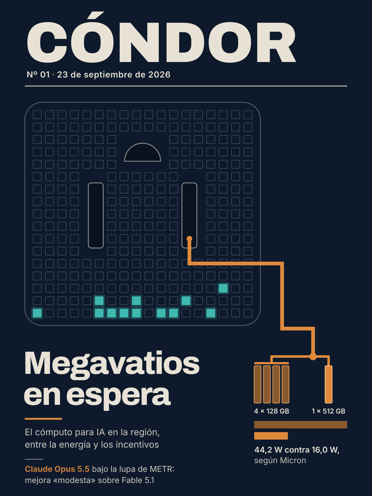

# Cóndor Nº 01 — Megavatios en espera
*23 de septiembre de 2026 · Semana ISO 2026-W39*

Argentina ofrece energía y Brasil resigna impuestos, pero los data centers para IA de la región siguen sin arrancar.
---

## Nota de fondo: Argentina ofrece energía, Brasil resigna impuestos: el cómputo para IA en la región sigue sin arrancar
*Los proyectos argentinos se miden en megavatios; el Redata brasileño apunta al costo del hardware. El nuevo módulo de memoria de Micron recuerda que buena parte de la cuenta se paga en equipamiento. Ninguno de los dos caminos está funcionando todavía.*
El martes 15 de septiembre, Luiz Inácio Lula da Silva sancionó en Brasil la ley del Redata, un régimen que exime a los data centers de tres impuestos federales y que, según Teletime, todavía depende de reglamentación para entrar en pleno funcionamiento. En Argentina, en cambio, la conversación sobre infraestructura para IA se sigue midiendo en megavatios: una nota de Bloomberg Línea compara los cerca de 32 MW instalados que registra un relevamiento de CABASE con una cartera de proyectos que habla de cientos de MW. Leídos juntos, los dos casos muestran dos recetas distintas para atraer cómputo: una se apoya en la oferta de energía; la otra, en el costo del equipamiento. Y tienen algo en común: por ahora, ninguna de las dos está en marcha.

El punto de partida argentino es chico. Según el relevamiento que la Cámara Argentina de Internet (CABASE) presentó en mayo, citado por Bloomberg Línea, el país tiene 13 centros de datos de más de 1 MW, con una capacidad instalada conjunta cercana a los 32 MW y concentrada principalmente en la Ciudad y la Provincia de Buenos Aires. La cartera de proyectos se apoya en la energía. Pampa Energía analiza un data center junto a su central térmica Loma de la Lata, en Neuquén, que podría alcanzar los 500 MW y funcionar con gas de Vaca Muerta. En la misma provincia, FlexDomes evalúa una primera fase de 120 MW por alrededor de US$1.400 millones. En Chubut, la polaca Green Capital analiza una instalación inicial de 300 MW, con una inversión estimada de US$3.000 millones y la posibilidad de ampliarla hasta los 3.000 MW. El anuncio más grande, Stargate Argentina, de OpenAI y Sur Energy, contemplaba hasta 500 MW y una inversión potencial de hasta US$25.000 millones. Sin embargo, según Bloomberg Línea, el proyecto "aún no avanzó y todavía depende de la firma de los acuerdos definitivos". En toda la lista se repiten los verbos "analiza" y "evalúa". Como marco, la nota señala al RIGI por la estabilidad regulatoria que ofrece.

Brasil movió otra palanca. La Lei 15.504/2026 crea el Regime Especial de Tributação para Serviços de Data Center (Redata), que exime a los data centers de las alícuotas del Imposto de Importação, el PIS/Cofins y el IPI. A cambio, les pide dos cosas: adoptar criterios de sustentabilidad, como usar energía de fuentes renovables o de baja emisión de carbono, y destinar al mercado interno al menos el 10% de su actividad de procesamiento de datos. El Estado brasileño acepta recaudar menos para lograrlo: según el dictamen aprobado en el Senado, basado en proyecciones de la Receita Federal, el impacto fiscal estimado es de R$ 7,25 mil millones en tres años, de los cuales R$ 5,2 mil millones corresponderían a 2026, año en que vencen los beneficios de PIS/Cofins e IPI. Es una previsión anterior a la sanción, y el impacto real dependerá de cuándo se reglamente el régimen.

El Redata apunta a la inversión inicial (capex), donde el equipamiento de cómputo pesa mucho, más que a la provisión de energía. La cláusula del 10% responde además a una pregunta que la nota de Bloomberg Línea no se hace: para quién sería ese cómputo. De hecho, esa nota menciona el RIGI solo como un marco de estabilidad regulatoria, sin decir que exija nada sobre el uso local de la capacidad.

Una noticia que no habla de América Latina muestra por qué el hardware es la otra mitad de la cuenta. El 16 de septiembre, Tom's Hardware informó que Micron presentó su primer RDIMM DDR5 de 512 GB para servidores, a 9200 MT/s. Con esos módulos se podrían armar servidores de hasta 12 TB de memoria. El argumento técnico es que, a medida que aumentan los núcleos por CPU, la memoria del host se vuelve el límite, y Micron incluye la agentic AI entre las cargas a las que apunta. La empresa no dio el precio, pero hay una referencia de escala: hoy un RDIMM DDR5-6400 de 256 GB se vende a alrededor de USD 19.000. Con componentes de ese precio, eximir el hardware del impuesto a la importación, como hace el Redata, tiene un efecto directo sobre el costo de montar capacidad. El módulo también tiene que ver con la energía. Según Micron, consume 16,0 W, contra 44,2 W de cuatro módulos de 128 GB: más de 60% menos potencia de operación. Son cifras del fabricante, todavía sin verificación independiente, y la producción en volumen está prevista recién para la segunda mitad de 2027. Aun así, muestran que cuánta capacidad útil entra en cada megavatio depende también de qué generación de hardware se instale, no solo de cuántos megavatios haya disponibles.

Para quien entrena o despliega modelos desde la región, la comparación deja tres cosas para seguir. La primera es la reglamentación del Redata: sin ella, el régimen no está operativo. La segunda es si algún proyecto argentino pasa de estar en evaluación a estar en obra; mientras no pase, el cómputo local a escala de IA depende de decisiones de inversión que todavía no se tomaron. La tercera es más técnica y menos visible: aunque lleguen los megavatios, la capacidad real va a depender de lo que cueste el hardware que se instale y de las condiciones de acceso que se negocien. Brasil ya puso esas dos variables en la ley y le asignó un costo fiscal explícito. En el relevamiento de CABASE, por ahora, la variable central sigue siendo la energía.

Fuentes: [Bloomberg Línea — La IA abre una carrera por US$31,6 billones: la carta energética de Argentina para captar data centers](https://www.bloomberglinea.com/latinoamerica/argentina/la-ia-abre-una-carrera-por-us316-billones-la-carta-energetica-de-argentina-para-captar-data-centers/), [TELETIME — Governo sanciona Redata (Lei 15.504/2026)](https://teletime.com.br/15/09/2026/governo-sanciona-redata-data-centers/), [Tom's Hardware (Anton Shilov) — Micron announces 512GB DDR5-9200 memory modules](https://www.tomshardware.com/pc-components/dram/micron-announces-512gb-ddr5-9200-memory-modules-with-16w-power-draw-up-to-12tb-per-server-claims-60-percent-less-energy-intensive-than-four-128gb-modules)
---

## Modelos fundacionales y LLMs
### Anthropic presenta Claude Opus 5.5: 66,4% en Terminal-Bench 4.0 y, según la empresa, 40% menos de costo que Opus 5

Anthropic presentó el 22 de septiembre de 2026 Claude Opus 5.5, el primer modelo de su nueva familia Claude 5.5. Es un modelo propietario: se accede por API y por las apps de Claude, sin pesos publicados. La compañía afirma que rinde al nivel de Claude Fable 5.1 en la mayoría de las tareas, con ventajas chicas en varios benchmarks, y que, con la configuración por defecto, cuesta 40% menos que Opus 5 en cargas de trabajo típicas. El precio es de USD 4 por millón de tokens de entrada y USD 20 por millón de salida, con cache reads a USD 0,20 por millón. En Terminal-Bench 4.0 reporta 66,4%, contra 52,3% de Opus 5 y 57,9% de GPT-6 Astra; en CursorBench 4.0 marca 57,8%, contra 46,6% de su antecesor. Está disponible en Amazon Web Services, Google Cloud y otras plataformas.

La novedad no es tanto el techo de capacidad como la relación costo-rendimiento: Anthropic dice ofrecer un rendimiento similar al de Claude Fable 5.1 a un costo menor que el de su Opus anterior, algo que pesa para equipos que usan agentes de código a escala con presupuestos acotados. METR, que evaluó solo la capacidad de I+D de IA, concluyó que "no representa un gran salto" respecto de Fable 5.1, pero que probablemente es una mejora modesta; según cobertura basada en su evaluación, a esfuerzo máximo el modelo "habla tanto que se come el descuento" de costo.

Según la propia empresa, es también su primer lanzamiento desde que propuso moderar el ritmo de avance de la frontera ("pacing the frontier"). Antes del lanzamiento lo probaron evaluadores externos, entre ellos Frontier Design y METR, y Anthropic sostiene que es el modelo con mejor desempeño que evaluó hasta ahora en su auditoría conductual automatizada. Una salvedad: todos los benchmarks y la cifra de ahorro los reporta la propia Anthropic y, por ahora, la fuente no incluye verificación independiente.
*Licencia: propietario*

→ [Anthropic](https://www.anthropic.com/claude-opus-5-5) — 2026-09-22

---

## Hardware e infraestructura
### Micron presenta un RDIMM DDR5 de 512 GB a 9200 MT/s: hasta 12 TB por servidor y 16 W por módulo

Micron presentó su primer módulo de memoria DDR5 de 512 GB para servidores, un RDIMM certificado para operar a 9200 MT/s con el voltaje estándar de 1,1 V, según informó Tom's Hardware el 16 de septiembre de 2026. Para alcanzar esa capacidad, el módulo apila varios dies de DRAM en vertical y los conecta con through-silicon vias (TSV); la compañía no revela qué chips usa ni cuántos. Con estos módulos se podrían armar servidores de hasta 12 TB de memoria. AMD e Intel los están validando con sus próximas plataformas de servidor, y Micron prevé empezar la producción en volumen en la segunda mitad de 2027. No es el primer RDIMM DDR5 de 512 GB del mercado: Samsung presentó los suyos en 2021, aunque no llegaron a difundirse, ni siquiera con la llegada de procesadores de más de 100 núcleos.

Las cifras de rendimiento son de Micron y todavía no tienen verificación independiente. Según la empresa, un módulo de 512 GB consume 16,0 W, contra 44,2 W de cuatro módulos de 128 GB: más de 60% menos potencia de operación, aunque tampoco para este cálculo Micron revela qué chips de memoria ni cuántos usó. En cargas de análisis Spark Support Vector Machine (SVM) limitadas por memoria, los sistemas con módulos de 512 GB rendirían hasta 1,4 veces más que los que usan módulos de 256 GB, pero Micron no dice cuánta memoria total tenían los sistemas comparados.

Micron apunta a bases de datos en memoria, analítica, virtualización, simulación y agentic AI. El dato importa porque, a medida que aumentan los núcleos por CPU, la memoria del host se vuelve el límite: con dos CPUs de 256 núcleos, 12 TB dan 24 GB por núcleo. Falta saber el precio de los módulos de 512 GB. Micron no lo informó, y hoy un RDIMM DDR5-6400 de 256 GB se vende a alrededor de USD 19.000.

→ [Tom's Hardware (Anton Shilov)](https://www.tomshardware.com/pc-components/dram/micron-announces-512gb-ddr5-9200-memory-modules-with-16w-power-draw-up-to-12tb-per-server-claims-60-percent-less-energy-intensive-than-four-128gb-modules) — 2026-09-16

---

## Regulación y política
### Un proyecto bipartidario en EE.UU. obligaría a la inteligencia a informar qué modelos de IA usa sobre los datos de la Sección 702 de FISA

El jueves 17 de septiembre, los representantes Addison McDowell (republicano, Carolina del Norte) y James Walkinshaw (demócrata, Virginia) presentaron en la Cámara de Representantes de EE.UU. un proyecto que obliga al Director de Inteligencia Nacional a entregarle al Congreso un informe sobre cómo se usa inteligencia artificial "para adquirir, analizar, consultar, diseminar o acceder de otro modo" a la información recolectada bajo la Sección 702 de la Foreign Intelligence Surveillance Act (FISA). El plazo es de 180 días desde que la ley se sancione. Además de describir los usos, el informe tiene que evaluar los safeguards que rodean a esas herramientas y detallar qué tipos de modelos se emplean.

La Sección 702 permite que agencias como la NSA y el FBI recolecten sin orden judicial comunicaciones de extranjeros en el exterior. Es polémica porque también se interceptan mensajes y llamadas de estadounidenses que se comunican con esos objetivos. Este año el Congreso no logró reautorizarla, pero sigue funcionando con su autorización judicial vigente.

El pedido de transparencia deja de mirar solo qué datos se recolectan y apunta también a con qué modelos se consultan y analizan. Para quien trabaja en ML el punto es concreto: el riesgo para la privacidad de un sistema de vigilancia depende tanto del acceso a los datos como de las capas de query y análisis automatizado que se montan encima. Por ahora es solo un proyecto presentado, no una ley.

Según el relevamiento de Nextgov/FCW, esa semana los representantes Mike Lawler y Josh Gottheimer presentaron además el Stop Rogue AI Act. Ese proyecto encarga al NIST estándares y buenas prácticas para "descubrir, verificar y controlar" agentes de IA, que los contratistas y organismos federales estarían obligados a incorporar al comprar y desplegar esos agentes.

→ [Nextgov/FCW (Edward Graham)](https://www.nextgov.com/artificial-intelligence/2026/09/tech-bills-week-monitoring-ais-use-under-section-702-preventing-abuse-automatic-license-plate-readers-and-more/416095/) — 2026-09-18

---

## Seguridad y alineación
### METR evaluó Claude Opus 5.5 antes del despliegue: mejora "modesta" sobre Fable 5.1 en capacidades de I+D de IA

El 22 de septiembre de 2026, METR publicó el resumen de su evaluación independiente previa al despliegue (predeployment) de Claude Opus 5.5, el modelo propietario de Anthropic. La evaluación se centró en cuánto podría acelerar el modelo la investigación y desarrollo (I+D) en IA, a partir de su desempeño en tareas difíciles y de horizonte largo. METR tuvo acceso vía API durante 10 días hábiles y usó cinco tareas: Budget NanoGPT Speedrun, Language Model Conceptual Argumentation (LMCA), Train a Program, Gaming Bot y Sunlight.

METR dice estar "razonablemente confiado" en que Opus 5.5 "no representa un gran salto" en capacidad de I+D de IA respecto de Fable 5.1, aunque "probablemente" sí una mejora modesta. Esa mejora aparece tanto en tareas verificables (Budget NanoGPT, Gaming Bot) como en tareas más difíciles de verificar (LMCA, Sunlight). El resumen no da resultados numéricos por tarea ni una medición de time horizon, y METR afirma además que el modelo todavía tiene debilidades cualitativas que un experto humano difícilmente tendría. Su conclusión se limita a la capacidad de I+D de IA: Anthropic, por su parte, afirma que Claude Opus 5.5 rinde al nivel de Claude Fable 5.1 en la mayoría de las tareas, con ventajas chicas en varios benchmarks.

El dato más fuerte viene de otro lado: un informe "altamente experimental y preliminar" de un equipo separado de METR, que estudia la aceleración de la I+D dentro de Anthropic. Ese informe estima una "~1.5X" de aceleración global de capacidades debida a la IA (1,5 años de progreso en 1), con "quizás" un 30% de probabilidad de llegar a 2X. METR aclara que el informe no dice a qué período se refiere, así que no queda claro si la cifra vale para el desarrollo de Opus 5.5. Además, ese equipo solo compartió sus conclusiones con los autores del resumen, no la evidencia de respaldo ni el detalle de su razonamiento, por lo que METR usa esa evidencia como insumo pero "no argumenta directamente en defensa de sus afirmaciones". Su propia conclusión es que el desarrollo del modelo fue "al menos algo" acelerado por IA, pero que es poco probable que lo haya sido "dramáticamente".

Para leer estas auditorías externas hay que tener en cuenta dos cosas. Primero, METR usó además una fuente de información que dice no poder revelar por ahora. Segundo, el texto final forma parte de la system card del modelo: METR escribió el borrador, Anthropic tuvo la oportunidad de revisarlo y editarlo, y después METR aprobó la versión final. El acuerdo de evaluación, además, le da a Anthropic derechos para suprimir partes del contenido del informe (redaction rights), y METR solo puede revelar públicamente ciertos hechos sobre ese proceso, como si Anthropic ejerció esos derechos o si algún hallazgo dependió de información suprimida.
*Licencia: propietario*

→ [METR](https://metr.org/blog/2026-09-22-claude-opus-5-5/) — 2026-09-22

---

## IA aplicada — Ciencia y salud
### AbbVie firma con Iambic un acuerdo multianual para descubrir moléculas pequeñas con el modelo Enchant v3

El 21 de septiembre de 2026, AbbVie e Iambic, una biotech de San Diego, anunciaron una colaboración multianual para acelerar el descubrimiento y desarrollo de terapias de molécula pequeña (small molecules) en inmunología, neurociencia y oncología. La base técnica del acuerdo es la plataforma de "superinteligencia molecular" de Iambic, que según el comunicado se apoya en Enchant v3 y NeuralPLexer en conjunto, y que la propia empresa define como IA propietaria integrada con experimentación química y biológica automatizada. Iambic describe Enchant v3 como un transformer multimodal de nueva generación que combina modalidades de datos biomédicos de todo el proceso de drug discovery y que fue entrenado sobre más de 6.000 propiedades moleculares. Iambic recibirá un pago inicial (upfront) y podrá cobrar pagos por hitos (milestones) sujetos a resultados y regalías escalonadas sobre ventas netas, pero el comunicado no revela ningún monto en USD.

El principal argumento de Iambic es la velocidad: según el comunicado, su plataforma llevó un candidato nuevo a la clínica en aproximadamente dos años. El texto no nombra ese programa ni presenta datos de eficacia en pacientes, así que la métrica disponible es el tiempo hasta la clínica y no el resultado clínico. Para quien trabaja en ML, lo interesante es que una big pharma paga por acceder a un modelo predictivo multitarea entrenado sobre miles de propiedades moleculares. Todavía falta probar que esa precisión predictiva se traduzca en mejores tasas de éxito en los ensayos, que es lo que termina de validar la apuesta.

→ [AbbVie (comunicado de prensa oficial)](https://news.abbvie.com/2026-09-21-AbbVie-and-Iambic-Announce-Collaboration-to-Accelerate-AI-driven-Drug-Discovery) — 2026-09-21

---

## IA aplicada — Industria y robótica
### Agility presenta Digit 5: un humanoide para trabajar sin barreras junto a operarios, con más de USD 300 millones en órdenes condicionadas a hitos

Agility Robotics presentó el 15 de septiembre de 2026 Digit 5, la nueva generación de su humanoide de propósito general para manufactura, depósitos y distribución. Frente a Digit 4, el salto está en el hardware. Un nuevo diseño de pierna con actuadores cicloidales propios le permite levantar en forma repetida cargas de hasta 50 lb (22,7 kg), un 40% más de payload. Alcanza alturas de hasta 7,2 pies (2,2 m), contra los 5,5 pies del modelo anterior. Esa cifra es la altura de alcance, no la del robot parado: según cobertura independiente, Digit 5 mide 5 pies 11 pulgadas (1,81 m) y pesa 284 lb. La nueva batería da 90 minutos de autonomía y se carga en 9, una relación trabajo/carga de 10:1 (Digit 4 tenía 2:1) que, según la empresa, permite más de 20 horas de trabajo productivo en un día de 24. El early access está previsto para el primer semestre de 2027 y la disponibilidad general para fines de 2027. Además, Agility espera que Digit 5 lleve marca CE para entrar a la Unión Europea, Gran Bretaña e Irlanda del Norte.

El punto técnico central es la seguridad cooperativa, no la destreza. Digit 5 está pensado para trabajar cerca de personas sin las barreras físicas que exige la automatización tradicional. Para eso combina tres cosas: detección de personas con algoritmos de IA propios y varios tipos de sensores, señales visuales y sonoras que avisan qué movimiento va a hacer, y un controlador de seguridad independiente que decide cómo reacciona el robot cuando detecta a alguien. Es lo que traba el paso de pilotos a despliegues a escala, y las normas todavía se están escribiendo: Agility participa en el reporte técnico ANSI/A3 TR R15.108, aún en desarrollo, y en la ISO 25785-1, el primer estándar internacional de seguridad para humanoides.

La cifra comercial hay que leerla con cuidado. Los "más de USD 300 millones" en órdenes multianuales son a mayo de 2026 y están "sujetos al cumplimiento de ciertos hitos contractuales". Según reportes basados en los documentos de la fusión, esa cifra está fuertemente concentrada en un solo cliente, no identificado: un contrato de "robots-as-a-service" a 3 años por 1.000 robots Digit v5, condicionado a hitos, que según esos documentos no es una medida de los ingresos del período. Para dimensionarla: Agility declaró USD 1,78 millones en ventas netas en 2025 y una pérdida operativa de USD 140,2 millones.

El anuncio llega mientras Agility se prepara para salir a bolsa mediante una fusión con la SPAC Churchill Capital Corp XI (Nasdaq: CCXI), anunciada el 24 de junio de 2026, que valora a Agility en USD 2.500 millones e incluye unos USD 200 millones de financiamiento PIPE liderado por Foxconn; la compañía resultante cotizaría con el ticker AGLT. Como antecedente, Digit 4 lleva más de 65.000 horas de operación en clientes de Norteamérica como GXO, Schaeffler, Amazon y Toyota Motor Manufacturing Canada.

→ [Agility Robotics (comunicado de prensa oficial)](https://www.agilityrobotics.com/content/agility-unveils-digit-5-humanoid-robot-built-for-cooperatively-safe-work-at-scale) — 2026-09-15

---

## Argentina
### Argentina tiene 32 MW en data centers, y los proyectos para IA hablan de cientos de MW que todavía nadie confirmó

Según un relevamiento que la Cámara Argentina de Internet (CABASE) presentó en mayo, citado por Bloomberg Línea, el país tiene 13 centros de datos de más de 1 MW, con una capacidad instalada conjunta cercana a los 32 MW y concentrada principalmente en la Ciudad y la Provincia de Buenos Aires. Bloomberg Línea comparó ese dato con la cartera de proyectos asociados a la demanda de IA.

Pampa Energía analiza un data center junto a su central térmica Loma de la Lata, en Neuquén, que podría alcanzar los 500 MW y funcionar con gas de Vaca Muerta, aunque, según Yahoo Finance, los inversores prefieren empezar con un piloto de 20-40 MW y llegar a los 500 MW solo después de una expansión. En la misma provincia, la estadounidense FlexDomes evalúa una primera fase de 120 MW por alrededor de US$1.400 millones. En Chubut, la polaca Green Capital analiza una instalación inicial de 300 MW, con una inversión estimada de US$3.000 millones y la posibilidad de ampliarla hasta los 3.000 MW. Bahía Blanca sumaría una primera etapa de 30 MW en un parque tecnológico de la zona franca, con energía de Pampa Energía.

Casi todos los verbos de la lista son "analiza" y "evalúa": no hay obras confirmadas. El anuncio más grande, Stargate Argentina, de OpenAI y Sur Energy, contemplaba hasta 500 MW y una inversión potencial de hasta US$25.000 millones. Según la nota de Bloomberg Línea, sin embargo, todavía no avanzó y depende de que se firmen los acuerdos definitivos. Según BNamericas, además, la primera fase sería de 100 MW, prevista para 2027, y no los 500 MW de una sola vez.

El artículo ubica esta competencia en el informe Global Data Centre Outlook 2026-2050 de PwC, que estima que la inversión global acumulada en centros de datos llegará a US$31,6 billones hasta 2050, y señala al RIGI como el marco que aporta estabilidad regulatoria para operar infraestructura crítica a gran escala. Más allá de eso, la nota de Bloomberg Línea no dice que el RIGI exija nada sobre el uso local de la capacidad ni se pregunta para quién sería ese cómputo; el Redata brasileño, en cambio, obliga a destinar al menos 10% del procesamiento al mercado interno. Para quien entrena o despliega modelos desde Argentina, el dato que importa es la distancia entre los megavatios instalados hoy y los que existen solo en proyectos en evaluación: el cómputo local a escala de IA depende todavía de decisiones de inversión que no se tomaron.

→ [Bloomberg Línea](https://www.bloomberglinea.com/latinoamerica/argentina/la-ia-abre-una-carrera-por-us316-billones-la-carta-energetica-de-argentina-para-captar-data-centers/) — 2026-09-17

---

## América Latina
### Brasil sanciona el Redata: exención de impuestos federales para data centers, con un costo fiscal estimado de R$ 7,25 mil millones en tres años

El presidente Luiz Inácio Lula da Silva sancionó el martes 15 de septiembre la ley que crea el Regime Especial de Tributação para Serviços de Data Center (Redata), publicada como Lei 15.504/2026 en una edición extra del Diário Oficial da União. La norma exime a los data centers de las alícuotas de tres impuestos federales (Imposto de Importação, PIS/Cofins e IPI) a cambio de dos contrapartidas. La primera es adoptar criterios de sustentabilidad en la operación, como el uso de energía de fuentes renovables o de baja emisión de carbono. La segunda es destinar al mercado interno al menos el 10% de su actividad de procesamiento de datos. Según el Senado Federal, ese piso baja al 8% para proyectos instalados en las regiones Norte, Nordeste y Centro-Oeste, que además tienen una reducción del 20% en las obligaciones de investigación, desarrollo e innovación.

El texto pasó por la Cámara de Diputados en febrero y el Senado lo aprobó a comienzos de septiembre. En ese trámite final, el relator en el Senado, Cid Gomes, tuvo que responder objeciones de la conducción de la Cámara de Diputados por un cambio de redacción en el criterio de sustentabilidad (de "limpia o renovable" a "renovable o de baja emisión"). Diputados lo consideró un cambio sustantivo; Cid Gomes lo defendió como un ajuste editorial.

Según el dictamen aprobado en el Senado, basado en proyecciones de la Receita Federal, el impacto fiscal estimado es de R$ 7,25 mil millones en tres años, de los cuales R$ 5,2 mil millones corresponderían a 2026, año en que vencen los beneficios de PIS/Cofins e IPI. Es una previsión anterior a la sanción, y el impacto real dependerá de cuándo se reglamente el régimen. Para la infraestructura de IA, donde el equipamiento de cómputo pesa mucho en la inversión inicial (capex), quitar el impuesto a la importación de ese hardware apunta a bajar el costo de instalar capacidad de entrenamiento e inferencia en el país. La cláusula del 10% busca que parte de esa capacidad atienda la demanda local y no solo la venta de cómputo al exterior. El régimen, sin embargo, todavía no está plenamente operativo porque depende de reglamentación, aunque un decreto presidencial publicado el mismo día de la sanción ya reglamentó una parte: qué ítems pueden importarse con el beneficio de arancel cero y por un plazo de 5 años.

→ [TELETIME](https://teletime.com.br/15/09/2026/governo-sanciona-redata-data-centers/) — 2026-09-15

---

## Ciencia y Espacio — Patagonia
### SAOCOM 1B cruza Bariloche 15 veces en cuatro días, y según el MCP solo una vez se podría ver: el viernes 25 a las 06:54

El SAOCOM 1B (NORAD 46265), gemelo del 1A que cubrimos en el número anterior, es un satélite de radar: trabaja igual de día que de noche, porque no depende de la luz del Sol para tomar datos. El jueves 24/09 a las 16:09 (hora argentina) estaba sobre 77,11°S y 161,63°O, a 651 km de altura y a 7,53 km/s. Entre esa hora y el lunes 28/09 pasa 15 veces por encima de San Carlos de Bariloche a más de 10° sobre el horizonte. Los pasos se agrupan en dos franjas fijas, una a la mañana (entre las 06:52 y las 09:27) y otra a la tarde (entre las 17:47 y las 20:05), y cada día llegan unos 17-18 minutos más tarde que el anterior. El más alto es el del jueves 24/09: sale a las 19:03, llega a 81° por el E a las 19:07 y se oculta a las 19:11. A esa hora el Sol está todavía a +6°, así que no se ve.

Con el filtro de visibilidad (que abajo ya sea de noche y que al satélite todavía le dé el Sol), el MCP deja un único paso: el viernes 25/09 sale a las 06:52, llega a su punto más alto a las 06:54, a solo 15° por el E, y se oculta a las 06:57. Dura 5 minutos. Hay una salvedad: el cálculo mira solo esa geometría de luz y no estima el brillo, y la propia documentación del servidor dice que un radar como el SAOCOM "nunca se ve a ojo desnudo". Conviene tomarlo como una oportunidad teórica, baja sobre el horizonte, y no como algo seguro. Para quien trabaja con datos satelitales, lo que importa es el patrón: 15 pasadas en 96 horas, a horas locales repetibles, todas útiles para adquirir datos porque el radar no necesita luz ni cielo despejado. Además, las predicciones salen de un TLE de medio día de antigüedad, un recordatorio de que cualquier planificación de adquisiciones depende de efemérides recientes.

→ [MCP patagonia-espacial](mcp://patagonia-espacial) — 2026-09-24

---

## Cómo verificamos este número
148 afirmaciones verificadas de forma independiente; 8 conflicto(s) entre notas resueltos por debate.
- 136 confirmada(s)
- 1 corregida(s)
- 9 matizada(s)
- 1 con corrección no aplicada(s)
- 1 no verificable(s)
